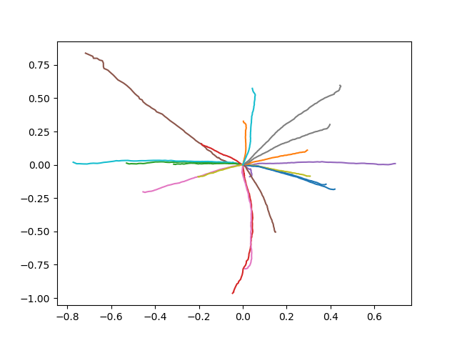
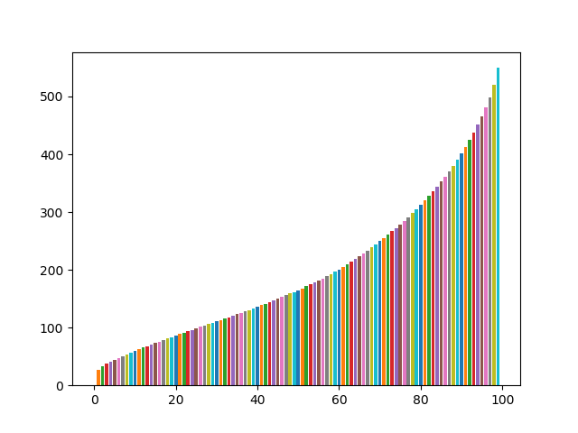

# Natural mouse movements
Generate human looking mouse movements with neural networks. This project uses two models, one to generate a path of points - and one to generate timing (how much time user spends at each point in path).

Models were built with Keras.
https://en.wikipedia.org/wiki/Keras

## Getting Started
Models that are ready to use are located in /models/. Can also be converted to .onnx with convert.py. The models can be retrained by running main_path.py and main_time.py.

## How it works
The data is formatted as [{x1, y1, t1}...{xn, yn, tn}] and make up a path of a specific number of points. Both models are set to generate this specific amount of points. The path model generates a path of X,Y coordinates and the timing model generates the time it takes at each point. By combining both models it's possible to create rather convincing mouse movements.

### A sample of generated paths
Start- and end points are normalized to start at origin.
X- and Y-labels: normalized screen width/height

### A sample of generated timings
Total time mouse stays at a position before going to next position. /
X-label: path points
Y-label: total milliseconds
